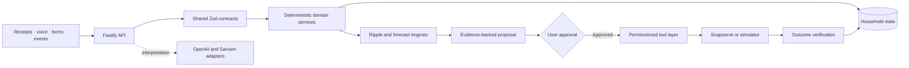

<p align="center">
  
</p>

<h1 align="center">Livora</h1>

<p align="center">
  <strong>Household intelligence that maintains state, traces consequences, and executes approved actions.</strong>
</p>

<p align="center">
  React 19 · Fastify · PostgreSQL · Prisma · OpenAI · Sarvam · Snapserve
</p>

---

Livora is a household operating system built around a simple premise: household life is interconnected, but most software manages each responsibility in isolation. A dinner plan can change inventory requirements, shopping cost, preparation time, and tomorrow's meals. Livora represents those relationships in shared household state and calculates the downstream effects of a change before proposing an action.

The kitchen is the first complete proof point. The same architecture is intended to support documents, bills, vehicles, subscriptions, appointments, and other household obligations.

> The repository is a working prototype. This README distinguishes current runtime behavior from configured integrations and planned architecture.

## Contents

- [Product model](#product-model)
- [Kitchen workflow](#kitchen-workflow)
- [System architecture](#system-architecture)
- [Implementation status](#implementation-status)
- [Repository structure](#repository-structure)
- [Local development](#local-development)
- [Configuration](#configuration)
- [Data, AI, and security boundaries](#data-ai-and-security-boundaries)
- [Testing and quality checks](#testing-and-quality-checks)
- [Deployment](#deployment)
- [Team](#team)
- [Project documentation](#project-documentation)

## Product model

Livora treats the household as four connected elements:

- **State:** current inventory, plans, obligations, preferences, and household members.
- **Events:** receipts, voice commands, scheduled meals, deliveries, and user decisions.
- **Relationships:** what an event requires, affects, reserves, consumes, or creates.
- **Evidence:** the quantities and state transitions behind every recommendation or action.

The operating loop is:

```text
OBSERVE → UNDERSTAND → UPDATE STATE → PREDICT → PLAN → ASK → ACT → VERIFY
```

Language models interpret unstructured input and produce natural-language explanations. Deterministic TypeScript services perform inventory arithmetic, recipe scaling, unit normalization, graph traversal, forecasts, and state transitions. PostgreSQL or the local development store holds application state; model context never becomes the system of record.

## Kitchen workflow

The primary demonstration follows one event through the complete state loop:

1. A user uploads a grocery receipt.
2. The extraction workflow converts receipt lines into reviewable inventory candidates.
3. The user confirms uncertain values before inventory changes.
4. A meal request, entered through text or voice, resolves to a recipe and serving count.
5. The meal engine scales ingredient requirements and compares them with available stock.
6. The ripple engine identifies shortages and affected plans without mutating canonical state.
7. Livora creates an evidence-backed action containing required, available, and missing quantities.
8. The user approves or rejects the action.
9. An approved action can call Snapserve when live credentials are configured, or use the labeled simulator.
10. The verification workflow reconciles the observed outcome with expected household state.

The current kitchen experience includes receipt review, inventory lots, unit normalization, recipe simulation, meal reservations, oldest-stock-first consumption, shortage detection, a smart cart, approval flows, and activity history.

## Household setup

The **Setup** section (`/onboarding`) is where a household tells Livora about itself. A first-time signed-in user lands here, and Home shows a progress card until every step is done.

- **Family:** your details and everyone at home, with ages and food preferences.
- **Documents:** Aadhaar, PAN, driving licence, passport, voter ID, vehicle RC, insurance and PUC. Photos and PDFs are encrypted before storage and open only for their owner. Identity numbers are kept masked (last four characters only). Expiry dates become reminders and Life Admin obligations.
- **Vehicles:** estimated mileage, tank size, odometer, service history and tyres. Logging a trip reduces the fuel left at the vehicle's mileage. Petrol bills (with an optional read-the-bill assist) give the real mileage, flag a drop and suggest why, and trigger refuel, service and tyre reminders.
- **Bills:** electricity bills with due-date reminders. Petrol bills live with each vehicle.
- **Vendors:** the milk, grocery, poultry and vegetable sellers a household orders from, with phone and location. Nothing is ever called on a made-up number.

The arithmetic (fuel left, real mileage, due dates, completion) lives in `packages/life` as pure, tested functions; the UI only displays the results.

## Demo login and subscriptions

The sign-in page has a **Try the demo** button. It signs in to a shared Clerk demo account (`DEMO_USER_EMAIL`, default `demo@livora.app`, created on first use) whose household is fully filled: family, documents, vehicles, bills, vendors and subscriptions. The server picks the account, so the button cannot be used to sign in as anyone else. A banner offers **Reset sample data** and **Leave demo**. In demo mode file uploads are off and vendor calls are simulated.

**Subscriptions** (Netflix, Prime Video, JioHotstar, Spotify, YouTube Premium, SonyLIV, ZEE5, Apple TV+, or your own) live under Setup, Bills. Each one appears in Life Admin with a **Pay** button that opens the provider's own billing page in a new tab (Livora never handles the payment). Tap **I've paid** to move the due date forward one billing cycle.

## System architecture



### Runtime layers

| Layer | Responsibility | Location |
| --- | --- | --- |
| Web application | Responsive SPA, PWA shell, routing, server-state queries, review and approval UI | `apps/web` |
| API | HTTP boundary, authentication, validation, request context, state access, workflow orchestration | `apps/api` |
| Contracts | Shared Zod request and response schemas | `packages/contracts` |
| Domain | Inventory, meal, ripple, forecast, unit, and approval-token logic | `packages/domain` |
| Life services | Timeline, recipes, smart cart, mobility, circular-living, and household views | `packages/life` |
| Agents | Receipt, voice, meal-planning, obligation, and action workflows | `packages/agents` |
| Tools | Agent allowlists, permission checks, and trace recording | `packages/tools` |
| Integrations | OpenAI, Sarvam, and Snapserve adapters | `packages/integrations` |
| Persistence | Per-user state backend and target Prisma schema | `packages/db` |

### Design decisions

- **Contracts are shared.** Web, API, domain services, agents, and tests use the same validation schemas.
- **Calculations are deterministic.** Models do not calculate inventory balances, shortages, costs, or graph effects.
- **Simulation is isolated.** What-if analysis returns a projected state delta without modifying canonical state.
- **Actions require evidence.** A purchase proposal identifies the source event and the required, available, and deficit quantities.
- **Execution is permissioned.** Agents call named tools through an allowlist instead of accessing providers or persistence directly.
- **Approval is bound to intent.** Consequential actions use an HMAC token tied to the action, payload hash, user, and expiry.
- **State changes are idempotent.** Commands that commit receipts, purchases, or external actions use idempotency keys.
- **Completion requires verification.** Starting an external action does not count as success; the observed result must be reconciled.

## Implementation status

| Area | Current state |
| --- | --- |
| Web and PWA | Implemented with desktop and mobile navigation, responsive product flows, and an in-app documentation portal. |
| Kitchen intelligence | Implemented for inventory, receipts, recipes, meal simulation, reservations, consumption, shortages, ripple views, smart cart, and action flows. |
| API and contracts | Implemented with Fastify and shared Zod schemas. |
| Authentication | Optional Clerk integration. When enabled, API requests require a valid session except for documented public routes. |
| Persistence | PostgreSQL stores a per-user JSONB state document when `DATABASE_URL` is configured. Local files provide a development fallback. |
| AI and voice | OpenAI and Sarvam adapters are implemented and activated by server-side credentials. Deterministic fallbacks cover supported demo paths. |
| External execution | Snapserve calling, status polling, webhook verification, and a simulator are implemented. Live calls require credentials and user approval. |
| Broader household modules | Timeline, obligations, mobility, circular-living, plans, and assistant surfaces exist at different levels of depth. Several use reference or sample data. |
| Relational household model | The Prisma schema describes the target normalized model, but the running state backend currently uses per-user JSONB documents. |
| Physical verification | Raspberry Pi and calibrated sensor ingestion remain roadmap items; the repository supports software-level delivery reconciliation. |
| Semantic memory | pgvector-backed retrieval remains a planned capability. |

Signed-in users start with separate household records. The open local demo exposes sample state for evaluation; sample content is not presented as a signed-in user's personal data.

## Repository structure

```text
.
├── apps/
│   ├── api/                 Fastify server and Vercel entry point
│   └── web/                 React SPA, PWA, product UI, and /docs portal
├── packages/
│   ├── agents/              Application workflows
│   ├── contracts/           Shared Zod schemas and TypeScript types
│   ├── db/                  State store exports and Prisma target schema
│   ├── domain/              Deterministic household engines
│   ├── integrations/        OpenAI, Sarvam, and Snapserve adapters
│   ├── life/                Household services, data, recipes, and cart logic
│   ├── tools/               Permissioned agent tool boundary
│   └── typescript-config/   Shared TypeScript configuration
├── tests/
│   ├── unit/                Domain, cart, service, and auth tests
│   ├── integration/         API, isolation, deployment-bundle, and demo tests
│   └── evals/               Receipt and multilingual voice evaluations
├── docs/                    Product, technical, and design specifications
├── scripts/                 API build and provider diagnostic scripts
├── api/                     Vercel serverless wrapper
├── vercel.json              Vercel build and route configuration
├── Dockerfile               Container build definition
└── package.json             Workspace commands
```

## Local development

### Prerequisites

- Node.js 22 or newer
- pnpm 10
- PostgreSQL only when testing durable database storage

### Install and run

```bash
pnpm install
pnpm dev:all
```

The default local endpoints are:

- Web application: `http://localhost:5173`
- Documentation portal: `http://localhost:5173/docs`
- Fastify API: `http://localhost:4000`
- API health: `http://localhost:4000/api/health`
- API readiness: `http://localhost:4000/api/ready`

The web development server proxies `/api` requests to the API. To run only one application:

```bash
pnpm dev       # web only
pnpm dev:api   # API only
```

### Development modes

| Configuration | Behavior |
| --- | --- |
| No Clerk keys | Open local demo mode with shared sample household state. |
| Clerk keys configured | Authenticated mode with a separate household record for each user. |
| No `DATABASE_URL` | State persists to local files under `apps/api/.data/users`; this is for development only. |
| `DATABASE_URL` configured | Per-user state persists in PostgreSQL. |
| No provider keys | Supported paths use deterministic fallback behavior or the explicitly labeled Snapserve simulator. |
| Provider keys configured | The API enables the corresponding OpenAI, Sarvam, or Snapserve adapter. |

## Configuration

Copy the example file before adding local values:

```powershell
Copy-Item .env.example .env
```

Never commit `.env`. Only variables prefixed with `VITE_` may be read by browser code.

### Core variables

| Variable | Required | Purpose |
| --- | --- | --- |
| `VITE_API_BASE_URL` | No | Overrides the web API base URL. Leave empty to use `/api`, the local proxy, and the deterministic fallback when the API is unavailable. |
| `VITE_CLERK_PUBLISHABLE_KEY` | No | Enables Clerk in the web application. Configure it with `CLERK_SECRET_KEY`. |
| `CLERK_SECRET_KEY` | No | Verifies Clerk sessions in the API and enables the authenticated data boundary. |
| `CLERK_AUTHORIZED_PARTIES` | No | Restricts which web origins may mint accepted Clerk tokens. |
| `DATABASE_URL` | Production | Enables durable PostgreSQL storage for per-user state and encrypted uploaded documents. |
| `DOCUMENT_ENCRYPTION_KEY` | No | Dedicated key for encrypting uploaded documents. Defaults to a key derived from `CLERK_SECRET_KEY`; keep it stable, because files stored under an old key cannot be read after it changes. |
| `APPROVAL_HMAC_SECRET` | Production actions | Signs and verifies approval tokens. |

### Provider variables

| Variable | Purpose |
| --- | --- |
| `OPENAI_API_KEY` | Receipt extraction, intent parsing, contextual answers, and transcript verification. |
| `OPENAI_MODEL` | Text model override. |
| `OPENAI_VISION_MODEL` | Receipt-vision model override. |
| `SARVAM_API_KEY` | Tamil, Tanglish, and English speech transcription. |
| `SARVAM_STT_MODEL` | Sarvam transcription model override. |
| `SNAPSERVE_API_KEY` | Enables live outbound vendor calls. |
| `SNAPSERVE_AGENT_ID` | Pins an agent instead of auto-resolving the active agent. |
| `SNAPSERVE_AGENT_NUMBER` | Overrides the caller number resolved from the agent. |
| `SNAPSERVE_WEBHOOK_SECRET` | Verifies signed Snapserve webhook requests. |

See [`.env.example`](.env.example) for polling, timeout, fallback, and provider endpoint options.

## Data, AI, and security boundaries

### Canonical state

Application state belongs in the persistence layer. Prompts, chat history, generated explanations, and provider transcripts are inputs or evidence, not authoritative state. State changes pass through validated commands and deterministic services.

### AI responsibilities

OpenAI and Sarvam may:

- extract structured candidates from receipts or natural language;
- interpret Tamil, Tanglish, and English requests;
- explain a computed result using household context;
- help classify a provider transcript.

They do not own inventory arithmetic, recipe scaling, unit conversion, approval, authorization, or state transitions.

### Approval and external actions

Live vendor actions require an approval token bound to:

```text
action_id + payload_hash + user_id + expiry
```

The API validates the token before calling the execution adapter. The webhook endpoint verifies Snapserve signatures when a webhook secret is configured. A provider response is recorded as an outcome and reconciled with the expected state rather than treated as automatically correct.

### User isolation

When Clerk is enabled, the API derives the user from the verified session rather than a client-supplied user identifier. Each user receives an isolated state store. Integration tests cover authentication boundaries and cross-user isolation.

## Testing and quality checks

Run the complete verification suite before submitting changes:

```bash
pnpm typecheck
pnpm --filter @household/web build
pnpm test
```

Useful focused commands:

```bash
pnpm test:unit
pnpm test:integration
pnpm test:evals
pnpm lint
pnpm build:api
```

The test suite covers:

- inventory updates, unit normalization, receipt staging, and delivery reconciliation;
- recipe scaling, meal simulation, reservations, consumption, and ripple generation;
- cart commands and quantity changes;
- approval-token and tool-permission boundaries;
- Clerk verification and authenticated route guards;
- per-user household isolation;
- multilingual voice intent and receipt extraction evaluations;
- the end-to-end signature demo workflow;
- the deployable Vercel API bundle.

## Deployment

### Vercel

The repository deploys the web application and API as one Vercel project:

1. `apps/web` builds to `apps/web/dist`.
2. `scripts/build-api.mjs` bundles the Fastify API and workspace dependencies into `api/_server.cjs`.
3. `api/index.js` exposes the serverless handler.
4. `vercel.json` routes `/api/*` to the function and rewrites all other paths to the SPA.

The generated API bundle is build output and must not be committed.

For production, configure `DATABASE_URL`, a strong `APPROVAL_HMAC_SECRET`, both Clerk keys if authentication is enabled, and only the provider credentials required by the deployment. Because `VITE_CLERK_PUBLISHABLE_KEY` is compiled into the frontend, changing it requires a new deployment.

Verify a deployment with:

```text
https://<deployment-host>/api/health
https://<deployment-host>/api/ready
```

The health response reports the authentication and storage modes. The readiness response reports state availability and which providers have credentials configured. A local file store is not durable on a serverless platform, so production deployments should use PostgreSQL.

### Container platforms

`Dockerfile`, `railway.json`, and `render.yaml` provide starting points for container-based deployment. Supply the same server-side environment variables and use PostgreSQL for durable state.

## Team

Livora is designed and developed by:

| Team member | Responsibility | GitHub |
| --- | --- | --- |
| **Gopinath** | Team Lead and Frontend Developer | [@goprocker](https://github.com/goprocker) |
| **Shivani SK** | Business and Operations Lead | [@shivaniisk](https://github.com/shivaniisk) |
| **Sai Charan** | Ripple Engine Developer | [@NINJA981](https://github.com/NINJA981) |
| **Pranesh Mithun** | Backend Developer | [@PraneshMithun-cse](https://github.com/PraneshMithun-cse) |
| **Reegan Kumaran** | Backend Developer | [@ReeganKumaran](https://github.com/ReeganKumaran) |
| **D Vishal** | Research | [@dvishaldharani-afk](https://github.com/dvishaldharani-afk) |

## Project documentation

| Document | Purpose |
| --- | --- |
| [`docs/PRD.md`](docs/PRD.md) | Product thesis, users, journeys, acceptance criteria, and scope. |
| [`docs/TRD.md`](docs/TRD.md) | Architecture, data model, domain engines, APIs, agent boundaries, and security model. |
| [`docs/DESIGN_SYSTEM.md`](docs/DESIGN_SYSTEM.md) | Interface tokens, responsive behavior, accessibility, and visual constraints. |
| [`AGENTS.md`](AGENTS.md) | Repository conventions, ownership boundaries, and required checks. |
| [`apps/web/src/docs/content.ts`](apps/web/src/docs/content.ts) | Source for the judge-facing documentation portal at `/docs`. |

## Product direction

The pitch deck frames the long-term product as a layer between people and their fragmented digital services. The architecture grows from the kitchen proof point into broader household state, richer ripple simulation, physical observation, and permissioned execution. These items describe direction, not current runtime guarantees.

The durable advantage is the feedback loop: each verified event improves the household's state, history, relationships, and future decisions. The choice of model or provider can change without moving canonical state or deterministic business rules out of the application.

---

<p align="center"><sub>Household decisions should be explainable before execution and verifiable afterward.</sub></p>
