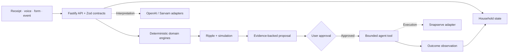

<p align="center">
  
</p>

<h1 align="center">Livora AI</h1>

<p align="center"><strong>A living intelligence layer for the household.</strong></p>

<p align="center">
  Understand what changed. Trace what it affects. Decide what happens next.
</p>

---

Livora is the working application for **Household Intelligence**. It brings household events, inventory, meals, obligations and actions into a shared model. The first proof point is the kitchen: a receipt updates stock, a meal plan changes demand, the system calculates shortages, and a proposed action waits for approval. Outcomes can then be checked against what actually happened.

> **Start here:** Run the app and open **`/docs`** for the 38-section project dossier. It covers the problem, novelty, architecture, AI and agent boundaries, data model, security, demo flow, limitations and roadmap.

[Explore the product](#the-product) · [See the architecture](#how-it-works) · [Run locally](#run-locally) · [Check implementation status](#implementation-status) · [Read the specs](#project-reference)

## The idea in one minute

Households use calendars, shopping lists, bills and service apps, but those tools rarely know how a change in one place affects another. Livora treats the household as **state plus relationships**, then applies deterministic rules to trace consequences. Language models help interpret messy input and explain results; they do not perform stock arithmetic or grant permission to act.

```text
Observe → Understand → Update state → Trace dependencies
       → Simulate → Plan → Ask → Act → Verify
```

| Instead of only… | Livora can… |
| --- | --- |
| Storing a receipt | Extract candidate items, request review, then update inventory. |
| Suggesting a recipe | Scale ingredients against available stock and show the deficit. |
| Saying “buy more” | Show the required, available and missing quantities behind a proposal. |
| Assuming a vendor action succeeded | Track the action and reconcile an observed outcome. |

## The product

The web app includes a household overview, timeline, kitchen inventory, receipt capture, recipe catalogue, meal planning, voice input, ripple views, forecasts, action approvals and activity history. It also has life administration, mobility and circular-living surfaces. Those wider domains are at different levels of maturity; see [Implementation status](#implementation-status).

### The kitchen proof point

1. **Observe:** Scan a grocery bill or describe a meal in text or speech.
2. **Understand:** Extract structured items or meal intent. Review uncertain receipt lines before committing them.
3. **Calculate:** Scale a recipe, compare it with current stock and identify shortages through TypeScript domain services.
4. **Simulate:** Explore a changed serving count without changing the real inventory.
5. **Ask and act:** Review the evidence for a proposed vendor action. A consequential call requires approval.
6. **Verify:** Record the provider result or delivery observation and reconcile it with the expected state.

The app includes a catalogue of Indian recipes, oldest-stock-first consumption, expiry and low-stock views, and idempotent inventory commands. The [documentation portal source](apps/web/src/docs/content.ts) explains the full judge-facing flow.

### Setup: complete household data collection

The **Setup** section (`/onboarding`) is where a household tells Livora about itself. A first-time signed-in user lands here, and Home shows a progress card until every step is done.

- **Family:** your details and everyone at home, with ages and food preferences.
- **Documents:** Aadhaar, PAN, driving licence, passport, voter ID, vehicle RC, insurance and PUC. Photos and PDFs are encrypted before storage and open only for their owner. Identity numbers are kept masked (last four characters only). Expiry dates become reminders and Life Admin obligations.
- **Vehicles:** estimated mileage, tank size, odometer, service history and tyres. Log a trip and the fuel left drops at the vehicle's mileage; add petrol bills (with an optional read-the-bill assist) and it works out the real mileage, warns when it has dropped and says why it might have. You get a refuel reminder before the tank is low, plus service and tyre reminders.
- **Bills:** electricity bills with due-date reminders; petrol bills live with each vehicle.
- **Vendors:** the milk, grocery, poultry and vegetable sellers you order from, with phone and location.

The arithmetic (fuel left, real mileage, due dates, completion) lives in `packages/life` as pure, tested functions; the UI only displays the results. Vendors are the household's own: nothing is called on a made-up number.

## How it works



The API and domain engines own state transitions, serving calculations, inventory arithmetic, permission checks and audit history. Provider adapters handle language, speech and outbound execution when configured. Agent context is never the authoritative household record.

### Stack

| Layer | In this repository |
| --- | --- |
| Web | React 19, TypeScript, Vite, Tailwind CSS v4, TanStack Router and Query, mobile PWA |
| API | Node.js, TypeScript, Fastify |
| Contracts | Shared Zod schemas in `packages/contracts` |
| Domain logic | Deterministic inventory, meal, ripple and forecast engines |
| Authentication | Optional Clerk web/API integration |
| Storage | Per-user JSONB document in PostgreSQL when configured; local JSON files otherwise |
| Providers | Server-side OpenAI, Sarvam and Snapserve adapters |
| Tests | Node test runner through `tsx` |

## Implementation status

This is a working prototype with explicit boundaries. Provider availability depends on environment configuration.

| Status | Capability |
| --- | --- |
| **In the repo** | React app, Fastify routes, shared contracts, kitchen inventory and meal engines, ripple simulation, receipt review, action approval, verification endpoints and tests. |
| **Configured when keys are supplied** | Clerk sign-in, OpenAI interpretation, Sarvam transcription and live Snapserve calls. Missing or failed providers use the documented fallback where supported. |
| **Configured when `DATABASE_URL` is supplied** | Per-user state stored as a JSONB document in PostgreSQL. Local development can use files. |
| **Reference or sample content** | Recipe catalogue and parts of the mobility, circular and vendor views. Signed-in household records start empty; sample data is not presented as a signed-in user's own state. |
| **Planned, not a current runtime claim** | Migration from JSONB documents to the relational Prisma schema, pgvector retrieval, calibrated physical sensors and broader cross-domain household coverage. |

The [Prisma schema](packages/db/prisma/schema.prisma) describes a relational target model. The running per-user backend currently saves one state document per user; the schema is not the active persistence layer.

## Run locally

**Requirements:** Node.js 22 or newer and pnpm 10.

```bash
pnpm install
pnpm dev:all
```

Open **`http://localhost:5173`** for the app or **`http://localhost:5173/docs`** for the documentation. The Fastify API listens on **`http://localhost:4000`** by default. Vite proxies `/api` requests to it.

The app can run without provider keys in open demo mode. To configure authentication, storage or integrations, copy `.env.example` to a root `.env` file and fill only the variables you need. On PowerShell, use `Copy-Item .env.example .env`; on macOS/Linux, use `cp .env.example .env`. **Never commit `.env`.**

| Variable | Purpose |
| --- | --- |
| `VITE_CLERK_PUBLISHABLE_KEY` + `CLERK_SECRET_KEY` | Enable sign-in in the web app and session verification in the API. Configure them together. |
| `DATABASE_URL` | Store signed-in users' state (and encrypted uploaded documents) in PostgreSQL; needed for durable state on serverless hosting. |
| `DOCUMENT_ENCRYPTION_KEY` | Optional dedicated key for encrypting uploaded documents. Defaults to a key derived from `CLERK_SECRET_KEY`. Keep it stable. |
| `OPENAI_API_KEY` | Enable model-backed assistant and extraction paths. |
| `SARVAM_API_KEY` | Enable speech-to-text paths. |
| `SNAPSERVE_API_KEY` | Enable live outbound calls; otherwise the adapter can use a labeled simulator. |
| `APPROVAL_HMAC_SECRET` | Sign approval tokens for consequential actions. |
| `VITE_API_BASE_URL` | Optional web API base URL; defaults to `/api`. |

Only `VITE_*` variables are exposed to browser code. Provider keys stay on the server. For the full list and optional settings, see [`.env.example`](.env.example).

### Data modes

- **Without Clerk keys:** one shared sample household is available for local demos; the API is open.
- **With Clerk keys:** authenticated users get separate, initially empty household records. The API rejects requests without a valid session, apart from its documented public health and webhook routes.
- **Without `DATABASE_URL`:** signed-in state is saved in local files under `apps/api/.data/users/`. This is unsuitable as durable storage on serverless deployments.
- **With `DATABASE_URL`:** the API stores each user's state in PostgreSQL as JSONB. This is distinct from the planned normalized Prisma model.

## Repository map

```text
apps/
  web/             React app, PWA and /docs portal
  api/             Fastify API, auth boundary and Vercel entry
packages/
  contracts/       Shared Zod request and response contracts
  db/              Runtime state store and planned Prisma schema
  domain/          Inventory, meals, ripple, forecast and approval logic
  life/            Recipes, timeline and other life-domain services
  agents/          Intake and action workflows
  integrations/    OpenAI, Sarvam and Snapserve adapters
  tools/           Typed tool boundary
docs/              Product, technical and design specifications
tests/             Unit, integration and evaluation tests
```

## Develop and verify

```bash
pnpm dev              # web only
pnpm dev:api          # API only
pnpm dev:all          # both apps
pnpm typecheck        # workspace type checks
pnpm build            # production web build
pnpm test             # unit, integration and eval tests
```

State-changing flows use shared validation contracts and idempotency keys. The tests exercise domain calculations, receipt and recipe flows, auth boundaries and per-user isolation using isolated stores. The [API route implementation](apps/api/src/app.ts) and [integration tests](tests/integration/life-api.test.ts) are the best starting points for verifying behavior.

## Deployment notes

[`vercel.json`](vercel.json) builds the web app (`apps/web/dist`), serves every `/api/*` request through one function (`api/index.js`), and rewrites all other paths to the single-page app so direct links such as `/recipes` or `/docs` work.

**How the API is deployed.** The shared workspace packages declare their entry as raw `.ts` files, which a packaged serverless function cannot load. So the API is bundled into one self-contained file, `api/_server.cjs`, by [`scripts/build-api.mjs`](scripts/build-api.mjs). Vercel runs that step itself (`vercel-build` in [`api/package.json`](api/package.json)) just before packaging the function. The bundle is generated, not committed; run `pnpm build:api` to build it locally.

**Set on the Vercel project:** both Clerk keys if enabling accounts, provider keys (server-side only), and `DATABASE_URL` for durable signed-in state. A serverless function's local filesystem is not a persistent household database. `VITE_CLERK_PUBLISHABLE_KEY` is baked into the web build, so redeploy after changing it.

**Check a deployment.** Open `https://<your-app>.vercel.app/api/health`:

- JSON with `config.auth: "enforced"` means the API is up and login is on.
- A Vercel `NOT_FOUND` page means the API function was not deployed. Check that the project builds from the repository root, where `vercel.json` and `api/` live.
- JSON starting `The API failed to start` names the startup problem.

## Project reference

| Read | Purpose |
| --- | --- |
| [Documentation portal source](apps/web/src/docs/content.ts) | The 38-section judge-facing dossier, rendered at `/docs`. |
| [Product requirements](docs/PRD.md) | Core loop, user journeys and MVP scope. |
| [Technical requirements](docs/TRD.md) | Architecture, domain engines, contracts and approval model. |
| [Design system](docs/DESIGN_SYSTEM.md) | Visual rules and accessibility principles. |
| [Agent instructions](AGENTS.md) | Repository conventions, ownership and safety boundaries. |

---

<p align="center"><sub>Built to make household decisions explainable, approved and verifiable.</sub></p>
